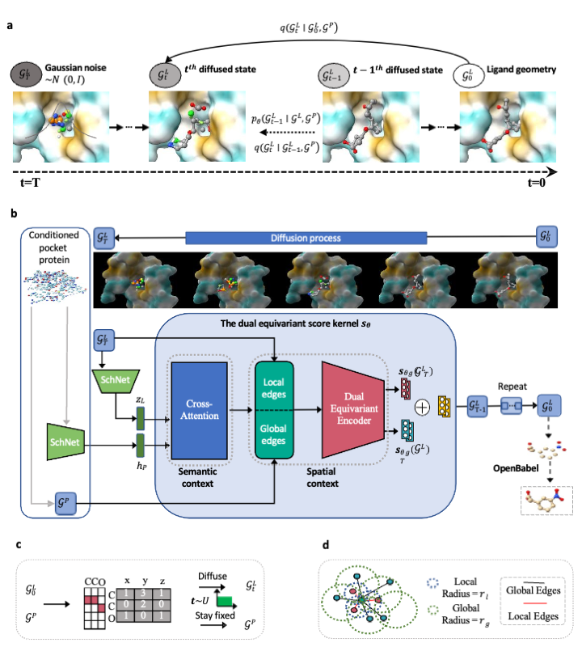

# PMDM: A dual diffusion model enables 3D binding bioactive molecule generation and lead optimization given target pockets

Official implementation of **PMDM**, a dual diffusion model enables 3D binding bioactive molecule generation and lead optimization given target pockets, by Lei Huang.

## 📢 News

- Our paper is accepted by **Nature Communications** !! (https://doi.org/10.1038/s41467-024-46569-1)
- If you are interested in generating molecules from scratch (without protein pockets), please refer to our previous work [MDM](https://github.com/tencent-ailab/MDM)
- Please contact me if you are interested in my work and look for academic collaboration. (layne_huang@outlook.com).

[](https://www.biorxiv.org/content/10.1101/2023.01.28.526011v1.abstract)
[](https://zenodo.org/doi/10.5281/zenodo.10631313)

<div align="center">  

</div>


<div align="center">
<!-- <a href="img/traj.html"> -->

<!-- </a> -->
</div>

[Uploading animation.html…]()


1. [Dependencies](#dependencies)
   1. [Conda environment](#conda-environment)
   2. [QuickVina 2](#quickvina-2)
   3. [Pre-trained models](#pre-trained-models)
2. [Benchmarks](#benchmarks)
   1. [CrossDocked Benchmark](#crossdocked)
   2. [Binding MOAD](#binding-moad)
4. [Training](#training)
5. [Inference](#inference)
   1. [Test set sampling](#sample-molecules-for-all-pockets-in-the-test-set)
   2. [Sample molecules for a given pocket](#sample-molecules-for-a-given-pocket) 
   3. [Metrics](#metrics)
   4. [QuickVina2](#quickvina2)
7. [Citation](#citation)

## Dependencies

### Conda environment
Please use our environment file to install the environment.
```bash
# Clone the environment
conda env create -f mol.yml
# Activate the environment
conda activate mol
```

### PyTorch install
You could follow the command to install the PyTorch
```bash
pip install torch==1.12.1+cu113 torchvision==0.13.1+cu113 torchaudio==0.12.1 --extra-index-url https://download.pytorch.org/whl/cu113
```

### Torch_geometric install
You should install the torch_geometric==2.4.0 and its corresponding dependencies.
```bash
pip install torch_geometric==2.4.0
wget https://data.pyg.org/whl/torch-1.12.0%2Bcu113/pyg_lib-0.4.0%2Bpt112cu113-cp39-cp39-linux_x86_64.whl
pip install pyg_lib-0.4.0+pt112cu113-cp39-cp39-linux_x86_64.whl
wget https://data.pyg.org/whl/torch-1.12.0%2Bcu113/torch_cluster-1.6.0%2Bpt112cu113-cp39-cp39-linux_x86_64.whl
pip install torch_cluster-1.6.0+pt112cu113-cp39-cp39-linux_x86_64.whl
wget https://data.pyg.org/whl/torch-1.12.0%2Bcu113/torch_scatter-2.1.0%2Bpt112cu113-cp39-cp39-linux_x86_64.whl
pip install torch_scatter-2.1.0+pt112cu113-cp39-cp39-linux_x86_64.whl
wget https://data.pyg.org/whl/torch-1.12.0%2Bcu113/torch_sparse-0.6.16%2Bpt112cu113-cp39-cp39-linux_x86_64.whl
pip install torch_sparse-0.6.16+pt112cu113-cp39-cp39-linux_x86_64.whl
wget https://data.pyg.org/whl/torch-1.12.0%2Bcu113/torch_spline_conv-1.2.1%2Bpt112cu113-cp39-cp39-linux_x86_64.whl
pip install torch_spline_conv-1.2.1+pt112cu113-cp39-cp39-linux_x86_64.whl
```

### QuickVina 2
For docking, install QuickVina 2:

```bash
wget https://github.com/QVina/qvina/raw/master/bin/qvina2.1
chmod +x qvina2.1
```

Preparing the receptor for docking (pdb -> pdbqt) requires a new environment which is based on python 2x, so we need to create a new environment:
```bash
# Clone the environment
conda env create -f evaluation/env_adt.yml
# Activate the environment
conda activate adt
```
### Pre-trained models
The pre-trained model (500.pt) could be downloaded from [Zenodo](https://zenodo.org/records/10630921) or [Google Drive](https://drive.google.com/file/d/1Zn8KbumzQ5S_Rc6lb4ezVvydgTeHjzbI/view?usp=drive_link).

## Benchmarks
All the dataset files should be put under the data folder.
### CrossDocked

#### Data preparation
Download and extract the dataset is provided in [Zenodo](https://zenodo.org/records/10630921)

The original CrossDocked dataset can be found at https://bits.csb.pitt.edu/files/crossdock2020/

### Binding MOAD
#### Data preparation
Download the dataset
```bash
wget http://www.bindingmoad.org/files/biou/every_part_a.zip
wget http://www.bindingmoad.org/files/biou/every_part_b.zip
wget http://www.bindingmoad.org/files/csv/every.csv

unzip every_part_a.zip
unzip every_part_b.zip
```

## Training
We provide two training scripts **train.py** and **train_ddp_op.py** for single-GPU training and multi-GPU training.

Starting a new training run:
```bash
python -u train.py --config <config>.yml
```
The example configure file is in `configs/crossdock_epoch.yml`

Resuming a previous run:
```bash
python -u train.py --config <configure file path>
```
The config argument should be the upper path of the configure file.

## Inference
### Sample molecules for all pockets in the test set
```bash
python -u sample_batch.py --ckpt <checkpoint> --num_samples <number of samples> --sampling_type generalized
```

### Sample molecules for given customized pockets
```bash
python -u sample_for_pdb.py --ckpt <checkpoint> --pdb_path <pdb path> --num_atom <num atom> --num_samples <number of samples> --sampling_type generalized
```
`num_atom` is the number of atoms of generated molecules (It is suggested to be no more than 30 if you use our pretrained model).

### Sample novel molecules given seed fragments
```bash
python -u sample_frag.py --ckpt <checkpoint> --pdb_path <pdb path> --mol_file <mole file> --keep_index <seed fragments index> --num_atom <num atom> --num_samples <number of samples> --sampling_type generalized
```
`num_atom` is the number of atoms of generated fragments. `keep_index` is the index of the atoms of the seed fragments.
You could utilize the following code to visualize the index of your molecule.
```
from rdkit import Chem
mol = Chem.SDMolSupplier(f)[0]
smiles = Chem.MolToSmiles(mol)
print(smiles)
mol.RemoveAllConformers()
for i, atom in enumerate(mol.GetAtoms()):
    atom.SetProp('molAtomMapNumber', str(i))
Draw.MolToImage(mol, size=(1000,1000))
```
For example, you could set keep index as 4 5 10 11 12 13 14 for the following molecule to generate novel molecules based on the desired fragment.

Here is an example command
```
python -u sample_frag.py --ckpt 500.pt --pdb_path data/2VUKcut10/2VUKcut10_pocket.pdb --mol_file data/2VUKcut10/2VUKcut10_ligand.sdf --keep_index 4 5 10 11 12 13 14 --num_atom 18 --num_samples 20 --sampling_type generalized
```
The reference generated molecule is shown as follows:


### Sample novel molecules for linker 
```bash
python -u sample_linker.py --ckpt <checkpoint> --pdb_path <pdb path> --mol_file <mole file> --keep_index <seed fragments index> --num_atom <num atom> --num_samples <number of samples> --sampling_type generalized
```
`num_atom` is the number of atoms of generated fragments. `mask` is the index of the linker that you would like to replace in the original molecule.
For example, you could mask 5 6 7 8 9 10 to generate new linkers.

Here is an example command
```
python -u sample_linker.py --ckpt 500.pt --pdb_path data/3wzecut10/3wzecut10_pocket.pdb --mol_file data/3wzecut10/3wzecut10_ligand.sdf --mask 5 6 7 8 9 10 --num_atom 4 --num_samples 1 --sampling_type generalized --batch_size 1 -build_method reconstruct
```
The reference generated molecule is shown as follows:


### Metrics
Evaluate the batch of generated molecules (You need to turn on the `save_results` arguments in sample* scripts)
```bash
python -u evaluate --path <molecule_path>
```

If you want to evaluate a single molecule, use `evaluate_single.py`.

### QuickVina2
First, convert all protein PDB files to PDBQT files using adt envrionment.
```bash
conda activate adt
prepare_receptor4.py -r {} -o {}
cd evaluation
```
Then, compute QuickVina scores:
```bash
conda deactivate
conda activate mol
python docking_2_single.py --receptor_file <prepapre_receptor4_outdir> --sdf_file <sdf file> --out_dir <qvina_outdir>
```
!!! You have to replace the path of your own mol and adt environment paths with the path in the scripts already.
### Citation
```
@article{huang2024dual,
  title={A dual diffusion model enables 3D molecule generation and lead optimization based on target pockets},
  author={Huang, Lei and Xu, Tingyang and Yu, Yang and Zhao, Peilin and Chen, Xingjian and Han, Jing and Xie, Zhi and Li, Hailong and Zhong, Wenge and Wong, Ka-Chun and others},
  journal={Nature Communications},
  volume={15},
  number={1},
  pages={2657},
  year={2024},
  publisher={Nature Publishing Group UK London}
}
```


